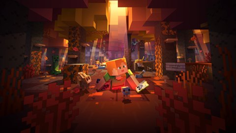

# Minecraft Update Artwork

A visual archive of Minecraft update artwork, from **Wilderness Bound** to the **Redstone Update**, arranged newest first.

**68 images · 26 updates**

Open **[index.html](index.html)** for the searchable offline gallery. Primary labels identify the archive's preferred source scene; they do not assert an official publisher ranking.

## Source collection and reconstructions

The default branch contains collected source artwork. The **[ai-reconstruction branch](https://github.com/TQNL/minecraft-update-artwork/tree/ai-reconstruction)** contains separately labelled reconstructions, enhancements and custom title treatments. Source files remain alongside derivatives except for the documented collection removals and replacements.

**[Reconstruction guide](RECONSTRUCTION.md)** · **[Stable PDF asset mapping](ASSET-MAP.md)** · **[Sources](SOURCES.md)** · **[Catalogue](catalogue.json)** · **[Credits](CREDITS.md)**

This checkout includes reconstructed derivatives. See **[progress and validation](reconstruction/progress.json)** for completed work and limitations.

## Browse the collection

| Update | Files | Primary source |
| :--- | ---: | :--- |
| [Wilderness Bound](artwork/01-wilderness-bound) | 1 | [P01](artwork/01-wilderness-bound/key-art-no-logo-2560x1440.png) |
| [Chaos Cubed](artwork/02-chaos-cubed) | 3 | [P02](artwork/02-chaos-cubed/key-art-no-logo-2560x1440.png) |
| [Tiny Takeover](artwork/03-tiny-takeover) | 4 | [P05](artwork/03-tiny-takeover/key-art-no-logo-2048x1440.png) |
| [Mounts of Mayhem](artwork/04-mounts-of-mayhem) | 2 | [P07](artwork/04-mounts-of-mayhem/key-art-full-composition-2048x1440.png) |
| [The Copper Age](artwork/05-the-copper-age) | 2 | [P09](artwork/05-the-copper-age/key-art-full-composition-2048x1440.png) |
| [Chase the Skies](artwork/06-chase-the-skies) | 1 | [P10](artwork/06-chase-the-skies/key-art-full-composition-2048x1440.jpg) |
| [Spring to Life](artwork/07-spring-to-life) | 3 | [P12](artwork/07-spring-to-life/key-art-square-variant-2048x2048.png) |
| [The Garden Awakens](artwork/08-the-garden-awakens) | 1 | [P13](artwork/08-the-garden-awakens/key-art-landscape-2560x1440.png) |
| [Bundles of Bravery](artwork/09-bundles-of-bravery) | 2 | [P14](artwork/09-bundles-of-bravery/key-art-with-minecraft-logo-2560x1440.png) |
| [Tricky Trials](artwork/10-tricky-trials) | 5 | [P17](artwork/10-tricky-trials/key-art-full-composition-without-title-2058x1440.png) |
| [Armored Paws](artwork/11-armored-paws) | 1 | [P19](artwork/11-armored-paws/badlands-trailer-artwork-1170x500.jpg) |
| [Bats and Pots](artwork/12-bats-and-pots) | 1 | [P20](artwork/12-bats-and-pots/bats-and-pots-release-banner-1170x500.jpg) |
| [Trails & Tales](artwork/13-trails-tales) | 5 | [P22](artwork/13-trails-tales/key-art-full-composition-with-title-2058x1440.png) |
| [The Wild Update](artwork/14-the-wild-update) | 5 | [P24](artwork/14-the-wild-update/key-art-landscape-without-logo-2560x1440.png) |
| [Caves & Cliffs Part II](artwork/15-caves-cliffs-part-ii) | 3 | [P29](artwork/15-caves-cliffs-part-ii/key-art-without-title-2560x1440.png) |
| [Caves & Cliffs Part I](artwork/16-caves-cliffs-part-i) | 4 | [P31](artwork/16-caves-cliffs-part-i/key-art-without-title-2560x1440.png) |
| [Nether Update](artwork/17-nether-update) | 3 | [P34](artwork/17-nether-update/key-art-without-title-2560x1440.png) |
| [Buzzy Bees](artwork/18-buzzy-bees) | 3 | [P36](artwork/18-buzzy-bees/key-art-smaller-alex-2560x1440.png) |
| [Village & Pillage](artwork/19-village-pillage) | 3 | [P38](artwork/19-village-pillage/key-art-without-logo-2560x1440.png) |
| [Update Aquatic](artwork/20-update-aquatic) | 5 | [P41](artwork/20-update-aquatic/key-art-landscape-without-logo-2560x1440.png) |
| [World of Color Update](artwork/21-world-of-color-update) | 2 | [P42](artwork/21-world-of-color-update/key-art-without-logo-2560x1440.png) |
| [Exploration Update](artwork/22-exploration-update) | 3 | [P45](artwork/22-exploration-update/key-art-full-original-8001x3391.jpg) |
| [Frostburn Update](artwork/23-frostburn-update) | 2 | [P47](artwork/23-frostburn-update/original-release-screenshot-1280x720.png) |
| [Combat Update](artwork/24-combat-update) | 2 | [P49](artwork/24-combat-update/original-official-artwork-1280x720.png) |
| [Bountiful Update](artwork/25-bountiful-update) | 1 | Separate title references |
| [Redstone Update](artwork/26-redstone-update) | 1 | Separate title references |

## About the files

- Original compositions and title treatments are kept separately.
- Dimensions describe stored pixels, not guaranteed native detail.
- Source artwork, promotional banners, fan art and reconstructed variants are distinguished in the catalogue.
- Descriptive metadata is removed from published image files.
- Stable asset IDs retain the numbers used in the PDF reviews; removed entries are not renumbered.

This is an independent archive. Artwork and trademarks belong to their respective creators; inclusion does not grant a new licence.
